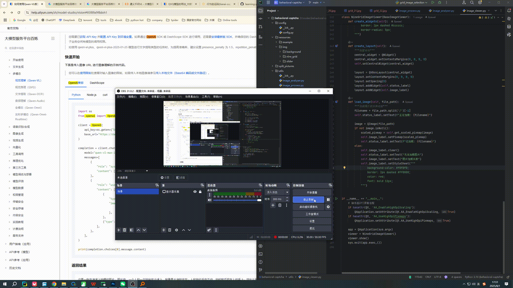

### 行为验证码（Behavioral CAPTCHA）
- 滑动拼图验证码（Slide Puzzle CAPTCHA）
    1. 基于抓包获取到的滑块、背景图片；
    2. opencv进行轮廓比对计算，分别获取滑块和缺口在背景图中坐标、滑动的横向距离；
    3. 结合win32gui模块截图指定滑块窗口，计算在windows窗口中的坐标；
    4. 使用pyautogui自动化工具模拟用户点击拖动滑块
- 点选图文验证码（Click-Based CAPTCHA）
  - 网格图片点选（Grid Image Selection）
    1. 分割9宫格图片
    2. Qwen-VL视觉理解分析图片
    3. AI分析问题答案
    4. 自动化工具模拟点击

Examples:

### pywinauto介绍
pywinauto是一个用于自动化Python 模块，适合Windows系统的软件（GUI），可以通过Pywinauto遍历窗口（对话框）和窗口里的控件，也可以控制鼠标和键盘输入
官网文档：https://pywinauto.readthedocs.io/en/latest/

### 文档参考
- [pywinauto的简单使用](https://blog.csdn.net/qq_39147299/article/details/132409817)
- [腾讯混元AI滑块验证（Web网页端）](https://github.com/sunliguo2020/learning-python/blob/563ec9712a03c16a88fdfcaa6914911a4bc2be3c/%E7%88%AC%E8%99%AB/%E6%A1%88%E4%BE%8B/%E8%85%BE%E8%AE%AF%E6%BB%91%E5%9D%97/discriminate.py)
